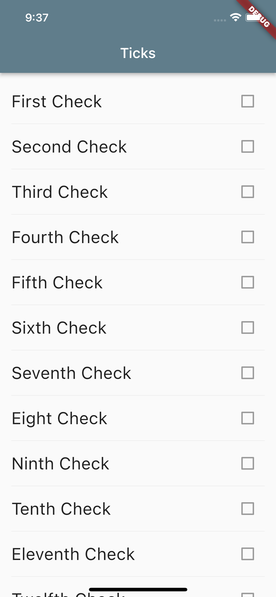

# Ticks

A box-ticking exercise for the busy, digital times. 

>It is one of several projects which could solve real problems and get used by real users, but their real objective is to help me learn [dart](https://dart.dev) and [flutter](https://flutter.dev). The other projects are: [flow](https://github.com/michalporeba/flow), [pataiu](https://github.com/michalporeba/pataiu) and [stuffed](https://github.com/michalporeba/stuffed). 

&nbsp;
## Problem domain

[Checklists](https://en.wikipedia.org/wiki/Checklist) are very popular ways to reduce cognitive load, increase safety, compliance and reduce accidents. 

This simplest check list could be a to-do list. This will a more dynamic checklist, to help perform, and produce output from various checklists I have to do in my valunteering life. 

Additionally, it should integrate with all other three project mentioned above. The outcome of a checklist could be converted into a task in the [flow](https://github.com/michalporeba/flow), update inventory in [stuffed](https://github.com/michalporeba/stuffed) or help with compliance in [pataiu](https://github.com/michalporeba/pataiu).

&nbsp;
## Technical challenges

* Reactive UI
* Local caching and collaboration in ocassionally connected distributed environments. 
* Interactions between multiple mobile apps. 


&nbsp;
## The results so far

From JSON representation of checks:

```javascript
{
      "id" : "35abdd55-bb69-4f90-ba43-3c78d615f184",
      "checks" : [
        { "id" : "a6087a1e-b73a-41b9-a3ae-f0c0f15dbb1c", "name": "First Check" },
        { "id" : "de30b788-2179-4682-bd46-839971c2aaef", "name": "Second Check" },
        { "id" : "56904b8e-4e8d-45f9-b139-e4fd4802984e", "name": "Third Check" },
        { "id" : "98e19e07-5ae0-4ef0-a4f9-fa949bcc09e9", "name": "Fourth Check" }
      ]
    }
```

I can render this  unimpressive checklist:



&nbsp;
## Notes

* I have upgraded flutter 2 to 3. There were issues with the gradle which I resolved by creating a new project and copying the gradle files over here.
* I'm following https://bloclibrary.dev/tutorials/flutter-todos/ for structure and to learn BLoC